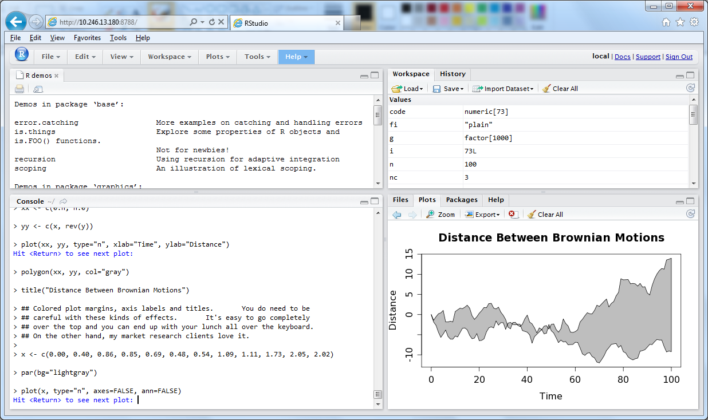
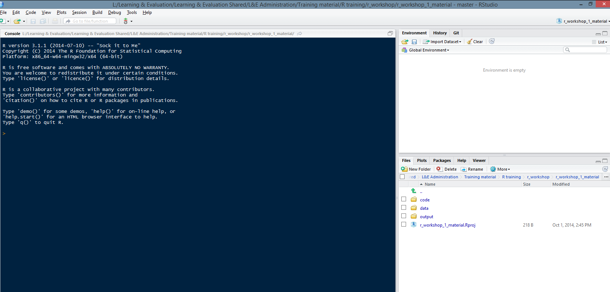

Workshop #1: Intro to R
========================================================
transition: rotate
transition-speed: slow
width: 1440
height: 900
incremental: true
date: October 02, 2014
css: ./theme/my_style.css


Programming = Magic
========================================================
incremental: false

> *"It is about __learning to cast spells__ that will summon up powerful daemons. People are impressed and awed by it.*     
      
> *In the primitive societies of the corporate (or non-profit) world, people will bow before you, worship you and reward you with gold, if you have these magical skills."*
     
> Hal Abelson and Gerald Sussman

***


So let's start with some magic!!
========================================================


Objective of the workshop series
========================================================
### Data analysis workflow:
* Get data
* Clean data
* Transform data
* Analyze data (Modeling, Visualization)
* Communicate results

Today's workshop: 
========================================================
incremental: false
### 10000 feet overview

***


Package
========================================================
incremental: false

__R package__ is the __equivalent__ of a smartphone __app__.     
     
Allows you to do more stuff.

***


R & Rstudio
========================================================
incremental: false




System set-up
========================================================
incremental: false




Get data: The working directory
========================================================
incremental: false

Need to tell R where to look for

```r
getwd()
list.files()
list.files('./data')

setwd('./data')
getwd()
list.files()

setwd('..')
getwd()
```

Everything is an object
========================================================
incremental: false

Try this

```r
my_list <- list.files('./data')
my_list
my_list[1]
```

Get data: Read .csv files
========================================================
incremental: false

Now that R knows where to look for, let's grab some data

```r
?read.csv
```

Get data: Read .csv files
========================================================
incremental: false


```r
read.csv('Alabama.csv') 

# What's wrong?
```

Get data: Read .csv files
========================================================
incremental: false


```r
read.csv('./data/Alabama.csv') 
```

Get data: Read .csv files
========================================================
incremental: false


```r
df <- read.csv('./data/Alabama.csv') 

# Check environment window
```
PRACTICE TIME!!
========================================================
type: practice

* What is a data frame?
* Other common data structure in R?

Clean data: Quick pick
========================================================
incremental: false


```r
head(df)

# Get first 5 rows
```

Clean data: Quick pick
========================================================
incremental: false


```r
head(df, 10)

# Get first 10 rows
```

Clean data: Quick pick
========================================================
incremental: false


```r
summary(df)

# Summary stats
```

Clean data: Quick pick
========================================================
incremental: false


```r
str(df)

# Object structure
```

Clean data: Quick pick
========================================================
incremental: false


```r
View(df)

# Object structure
```


For loops: Toy example
========================================================
incremental: false


```r
# For loops: Toy example
for (coin in 1:10) {
  print(paste('I have', coin, 'dollars in my pocket'))
}
```


For loops: Toy example
========================================================
incremental: false

Could we use a for loop to automatically show the first rows of each file in the data folder?

PRACTICE TIME!!
========================================================
type: practice

Complete the code below so it prints on the screen the path to each file in the data folder

```r
for (file in XXXX) {
  print(paste0('./data/', XXXX))
}
```

PRACTICE TIME!!
========================================================

Complete the code below so it prints on the screen the path to each file in the data folder

```r
for (file in my_list) {
  print(paste0('./data/', file))
}
```

PRACTICE TIME!!
========================================================
type: practice

Complete the code below to read each file in the data folder

```r
for (file in my_list) {
  path_to_file <- paste0('./data/', file)
  df <- XXXX
  assign(file, df)
}
```

PRACTICE TIME!!
========================================================

Complete the code below to read each file in the data folder

```r
for (file in my_list) {
  path_to_file <- paste0('./data/', file)
  df <- read.csv(path_to_file)
  assign(file, df)
}
```

PRACTICE TIME!!
========================================================
type: practice

Add a line to print the first rows of each file on the screen 

```r
for (file in my_list) {
  path_to_file <- paste0('./data/', file)
  df <- read.csv(path_to_file)
  assign(file, df)
  XXXX
}
```

PRACTICE TIME!!
========================================================

Replace last line with the right code to print the first rows of each file on the screen 

```r
for (file in my_list) {
  path_to_file <- paste0('./data/', file)
  df <- read.csv(path_to_file)
  assign(file, df)
  print(head(df))
}
```

Clean data: Remove incomplete records
========================================================
incremental: false


```r
complete.cases(df) 

# logical vector
```

Clean data: Remove incomplete records
========================================================
incremental: false


```r
complete.cases(df) 

# logical vector
```

Clean data: Remove incomplete records
========================================================
incremental: false


```r
sum(complete.cases(df))

# ??? What happened here?
```

Clean data: Remove incomplete records
========================================================
incremental: false


```r
sum(complete.cases(df))

# What happened here?
# Why is it useful?
```

Clean data: Remove incomplete records
========================================================
incremental: false

Compute number of complete / missing records

```r
paste("The dataset contained", sum(complete.cases(df)), "complete records" )
```

Clean data: Remove incomplete records
========================================================
incremental: false

Remove incomplete records

```r
df <- subset(df, complete.cases(df))
```

PRACTICE TIME!!
========================================================
type: practice

Let's add a new line of code to our loop to remove incomplete cases

```r
for (file in my_list) {
  path_to_file <- paste0('./data/', file)
  df <- read.csv(path_to_file)
  XXXX
  assign(file, df)
  print(head(df))
}
```

PRACTICE TIME!!
========================================================

Let's add a new line of code to our loop to remove incomplete cases

```r
for (file in my_list) {
  path_to_file <- paste0('./data/', file)
  df <- read.csv(path_to_file)
  df <- subset(df, complete.cases(df))
  assign(file, df)
  print(head(df))
}
```


Analyze data: Visualization
========================================================
incremental: false

Basic scatter plot PRE vs POST scores

```r
plot(df$pre, df$post) # Create plot
title(unique(df$state)) # Add a title
```

Functions: Toy example
========================================================
incremental: false

Create a function that returns the sum of 2 numbers

```r
sum_2 <- function(x, y) {
  x + y
}

sum_2(3,4)
```

PRACTICE TIME!!
========================================================
incremental: false
type: practice

Can we create a function that returns a scatter plot of PRE vs POST with the name of the State as title?


```r
plot_scores <- function(XXXX){
  XXXX
  XXXX
}
```

PRACTICE TIME!!
========================================================
incremental: false

Can we create a function that returns a scatter plot of PRE vs POST with the name of the State as title?


```r
plot_scores <- function(x){
  plot(x$pre, x$post) # Create plot
  title(unique(x$state)) # Add a title
}

plot_scores(df)
```

PRACTICE TIME!!
========================================================
incremental: false
type: practice

Putting everything together: Create a for loop from scratch that use the plot_scores function, and generate one plot for each file in the data folder


```r
for (file in my_list){
  # Complete the loop
}
```

PRACTICE TIME!!
========================================================
incremental: false

Putting everything together: Create a for loop from scratch that use the plot_scores function, and generate one plot for each file in the data folder


```r
for (file in my_list){
  path_to_file <- paste0('./data/', file)
  df <- read.csv(path_to_file)
  df <- subset(df, complete.cases(df))
  plot_scores(df)
}
```

Publishing results
========================================================
incremental: false

* Review .Rpres documents
* Time permitting: Review demo code
